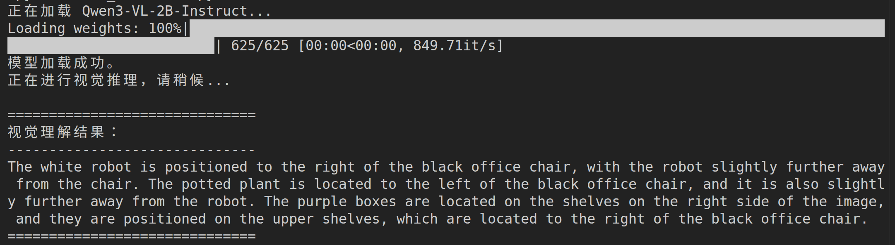

# ZhiruiSHEN-VLN

  <a href="#zh">🇨🇳 中文</a> | <a href="#en">🇬🇧 English</a>

重启电脑后可先参考环境快速恢复手册：[reset.md](reset.md)

<b>🇨🇳 中文版本 (Chinese)</b>

## 2026-03-12: Node 1 联调完成
* **进展**：成功在 Windows 宿主机的 Isaac Sim (Jazzy 启动器环境) 与 WSL 内部的 ROS 2 之间建立了底层通信桥梁。
* **测试**：通过 `teleop_twist_keyboard` 成功下发 `/cmd_vel` 跑通了小车的物理运动。
* **演示**：录制了联调成功的视频，保存在 `ROS 2_topic_stream.mp4`。
* **踩坑记录**：解决了 Windows/WSL 跨网段下 FastDDS 的共享内存通信死锁问题。

## 2026-03-13: Node 2 文献综述与模型选择完成
* **调研范围**：精读 2023–2026 年间 VLN 领域 5 篇核心论文，聚焦连续环境（VLN-CE）下的感知、记忆与决策机制。
* **核心文献**：覆盖空间映射（BEVBert）、内存效率（MapNav）、端到端控制（Uni-NaVid）、进度监控（Progress-Think）、持续学习（CMMR-VLN）五个技术维度。
* **模型选择**：确定构建**层次化语义增强 VLA 架构（HSA-VLM）**，集成 ASM 语义地图记忆层与 Uni-NaVid 流式决策层。
* **下一步**：启动节点 3，配置 Habitat-Sim 仿真环境并加载预训练权重。

## 2026-04-07: Node 3 基础导航与全自动测试完成

### 环境修改：从 WSL+windows组合 逃离至原生 Linux
* **WSL 跨网段通信瓶颈**：在使用过程中中发现，WSL 2 采用的虚拟 NAT 网络架构，导致运行在 WSL 内部的 ROS 2 与 Windows 宿主机上的 Isaac Sim 处于完全不同的子网。尽管尝试通过端口映射和 FastDDS 配置进行底层穿透，但海量并发的传感器数据（特别是高频的 `/tf` 坐标树和点云数据）在跨网段组播时，几乎无法对接，导致 Nav2 算法甚至无法链接，有尝试使用Docker来进行操作，但是一想到转发一层到wsl,然后wsl转发到docker,我立马放弃。
* **外接硬盘原生系统方案**：为彻底消灭网络虚拟化带来的通信损耗，最终决定购入高速硬盘盒(听取建议购入512G)，并通过 Type-C 接口直连笔记本（拯救者 Y7000P 2024），将一套纯净的 Ubuntu 22.04 原生系统直接烧录至外接硬盘中，实现了 Isaac Sim 与 ROS 2 的同系统极速本地回环通信。

    **tip:** 经过测试，甚至不需要配置什么乱七八糟的，超级简单，***强烈建议使用这个方案！！！***
* **原生 Linux 部署踩坑记录**：
  1. **NVIDIA 驱动与渲染黑屏**：外接系统初次引导时，遭遇了混合显卡调度导致的黑屏死机。被迫进入 TTY 命令行模式，手动卸载开源驱动，重新挂载 NVIDIA 专有驱动及 CUDA Toolkit，才成功唤醒 Isaac Sim 的底层渲染。
  2. **FastDDS 共享内存 (SHM) 死锁**：在原生系统的极速通信下，频繁重启 Nav2 节点极易触发 `RTPS_TRANSPORT_SHM Error`。系统强杀残留的守护进程会导致共享内存段被锁死，必须通过 Linux 底层指令 `rm -rf /dev/shm/fastrtps_port*` 暴力清空僵尸端口，并重启 `ros2 daemon` 才得以根治。

### 测试进展与自动化评估
* **进展**：在重构后的纯净原生环境下，成功于自定义的大型仓库场景（Warehouse Map）中，跑通了基于 Nav2 框架的 AMCL 定位机制与全局/局部路径规划。
* **自动化测试部署**：
  * 基于 `nav2_simple_commander` 编写了 `auto_test_node3.py` 全自动测试脚本，全面接管小车的底层控制。
  * 脚本位置（可点击直达）：[src/auto_test_node3.py](src/auto_test_node3.py)
  * 在大地图的安全区间内（X, Y 坐标范围 -3.0m 到 4.0m），设置了 10 个跨度极大的目标点。
  
    **Tips：** 没有设置临界是因为小车会报错，对于它而言，地图是黑的，无法过去。
* **测试结果**：10 次长距离跨点导航全部达成，最终成功率高达 **10/10 (100.0%)**。完整执行日志可点击直达：[Node 3 实验日志](data/node3_experiment_log_20260407_202902.txt)。

#### Node 3 自动化测试数据表

这 10 次测试覆盖了仓库地图内不同象限与中心区域，路径跨度大、方向变化多，能较全面地反映当前导航链路的稳定性。

| 测试序号 | 目标坐标 (X, Y) | 执行结果 |
| --- | --- | --- |
| 1 | (-3.0, -3.0) | 成功到达 |
| 2 | (3.0, -3.0) | 成功到达 |
| 3 | (3.0, 4.0) | 成功到达 |
| 4 | (-3.0, 4.0) | 成功到达 |
| 5 | (0.0, 0.0) | 成功到达 |
| 6 | (-2.0, -1.0) | 成功到达 |
| 7 | (2.0, 1.0) | 成功到达 |
| 8 | (-1.0, 3.0) | 成功到达 |
| 9 | (1.0, -2.0) | 成功到达 |
| 10 | (0.0, 2.0) | 成功到达 |

**汇总**：成功 10 次，失败 0 次，成功率 **100.0%**。

**Tips**：这里所有操作都是使用自动化进行，一方面是因为手动在Rivz这个软件上使用箭头啥的无法确定具体跑到哪里，另一方面，之后使用的大模型嵌入肯定也是类似我这种方式发布命令的，目前看来，没有问题，就是这个车跑的确实慢，但是车速可以进行调节的，开的快会导致过头啥的一系列问题，默认速度够了，仿真而已。

### 仿真与传感器排障 (Troubleshooting)
1. **时钟不同步，TF 直接报错**：一开始 RViz2 用的是电脑真实时间，但 Isaac Sim 发的是仿真时间（Sim Time），两边时间对不上，TF 消息就会被系统当成“过期数据”丢掉，所以出现 `Frame [map] does not exist`。后来给相关节点统一加上 `--ros-args -p use_sim_time:=True`，时间就对齐了。
2. **雷达链路断开，AMCL 没法工作**：AMCL 依赖 2D 雷达话题 `/scan`，但我们排查发现，`.usd` 场景保存后会把临时 `renderProductPath` 写成失效的绝对路径，重启后 2D 雷达渲染链路断掉，`/scan` 就没数据了。
3. **换个思路：用 3D 雷达“压”出 2D 雷达**：与其死磕图形节点，不如直接用正常的 3D 点云话题 `/front_3d_lidar/lidar_points`，再用 `ros-humble-pointcloud-to-laserscan` 转成 2D 的 `/scan`。这样 AMCL 就能稳定收到数据，导航也恢复正常。

## 2026-04-11: Node 4 大模型本地推理与视觉感知测试完成
* **进展**：在原生 Linux 环境下，成功本地部署 **Qwen3-VL-2B-Instruct** 并完成仓库场景视觉理解测试。在 Isaac Sim 同时运行条件下，推理链路稳定，无显存抢占导致的崩溃。
* **部署方式**：
  * 运行环境：`isaaclab` Conda 环境。
  * 关键依赖：`transformers` + `bitsandbytes`。
  * 加载策略：4-bit 量化加载（NF4）+ `bfloat16` 计算。
* **性能结果（当前机器）**：
  * 显存占用约 1.5GB（模型侧）。
  * 单次推理延迟约 1.2s（仓库截图场景，短文本输出）。
  * 在 Isaac Sim + ROS 2 同时在线情况下可持续运行。

### 为什么 Node 4 先用 2B，而不是 8B
Node 4 的职责不是离线写长文，而是在线感知与导航链路中的实时语义解析。我们重点看的是“稳定 + 实时 + 可长期运行”，而不是单次极限精度。

| 维度 | Qwen3-VL-2B-Instruct（当前采用） | 8B 级模型（评估结论） |
| --- | --- | --- |
| 显存压力 | 4-bit 后可控，能与 Isaac Sim 共存 | 即使量化后仍显著吃显存，容易与仿真争抢 |
| 推理延迟 | 约 1.2s，满足 Node 4 在线节奏 | 延迟明显上升，影响实时闭环 |
| 长时间稳定性 | 更容易稳定跑满全流程 | 更易触发 OOM 或性能抖动 |
| 工程复杂度 | 直接落地，调度简单 | 需要更激进的内存和任务调度策略 |

**结论**：Node 4 当前阶段优先采用 **Qwen3-VL-2B-Instruct**，以保证联调稳定和实时响应。

**8B 的定位**：8B 不是放弃，而是作为后续增强方向。
* 路线 A：在离线评估阶段引入 8B，对复杂场景描述质量做上限测试。
* 路线 B：在后续硬件升级（更大显存）或双机分布式部署时，将 8B 作为高精度感知后端。
* 路线 C：保留 2B 作为在线主模型，8B 作为低频复核模型（例如关键帧二次判读）。

### 测试内容与结果
* **多模态理解测试**：输入 Isaac Sim 仓库截图，要求模型识别机器人、办公椅、盆栽、紫色货箱并描述相对空间关系。
* **空间方位验证**：模型能够稳定给出“机器人在椅子右侧”“盆栽在椅子左侧”“紫色盒子位于右侧货架”等关键关系，未出现明显方位性幻觉。
* **工程结论**：当前模型可作为 Node 4 的可用版本，满足下一步桥接节点开发前的感知侧需求。

#### Node 4 实验截图与推理结果

注：上图为本地推理终端输出截图，展示了模型在仓库场景下的空间关系理解结果。

* **下一步**：启动 Node 5，设计并实现 ROS 2 Interface Bridge，将大模型自然语言输出映射为 Nav2 可执行的 `Pose` 目标坐标。

<b>🇬🇧 English Version</b>

## 2026-03-12: Node 1 Integration Completed
* **Progress**: Successfully established the underlying communication bridge between Isaac Sim (Jazzy launcher environment) on the Windows host and ROS 2 inside WSL.
* **Testing**: Successfully verified the physical movement of the robot by publishing to `/cmd_vel` via `teleop_twist_keyboard`.
* **Demo**: Recorded a video demonstrating the successful integration, saved as `ROS 2_topic_stream.mp4`.
* **Troubleshooting**: Resolved the FastDDS shared memory communication deadlock issue across the Windows/WSL subnet boundaries.

## 2026-03-13: Node 2 Literature Review & Model Selection Completed
* **Survey Scope**: In-depth review of 5 core VLN papers (2023–2026), focusing on perception, memory, and decision-making in continuous environments (VLN-CE).
* **Key Papers**: Covering five technical dimensions — spatial mapping (BEVBert), memory efficiency (MapNav), end-to-end control (Uni-NaVid), progress monitoring (Progress-Think), and continual learning (CMMR-VLN).
* **Model Selection**: Decided to build a **Hierarchical Semantics-Augmented VLA architecture (HSA-VLM)**, integrating an ASM-based memory layer and Uni-NaVid's streaming action decoder.
* **Next Step**: Launch Node 3 — configure Habitat-Sim simulation environment and load pretrained weights.

## 2026-04-07: Node 3 Basic Navigation & Automated Testing Completed

### Environment Update: Migrating from WSL+Windows to Native Linux
* **WSL cross-subnet bottleneck**: ROS 2 in WSL and Isaac Sim on Windows were on different subnets due to WSL2 NAT networking. In practice, high-frequency topics (especially `/tf` and point clouds) were unstable across subnet multicast, making Nav2 hard to keep stable.
* **Native external-disk solution**: I moved to a clean Ubuntu 22.04 native system on an external SSD (USB-C direct connection). This removed virtualization overhead and made local Isaac Sim <-> ROS 2 communication much smoother.

* **Native Linux troubleshooting notes**:
  1. **NVIDIA driver black screen**: On first boot, mixed-GPU scheduling caused a black screen. Fixed by entering TTY, reinstalling NVIDIA proprietary drivers, and restoring CUDA.
  2. **FastDDS SHM deadlock**: Frequent Nav2 restarts sometimes triggered `RTPS_TRANSPORT_SHM Error`. Clearing stale shared-memory ports with `rm -rf /dev/shm/fastrtps_port*` and restarting `ros2 daemon` solved it.

### Testing Progress & Automated Evaluation
* **Progress**: In the rebuilt native environment, AMCL localization and global/local planning ran successfully in our custom Warehouse Map.
* **Automation setup**:
  * Implemented a fully automated script based on `nav2_simple_commander`: `auto_test_node3.py`.
  * Script location (click to open): [src/auto_test_node3.py](src/auto_test_node3.py)
  * Selected 10 target points across safe map regions (X, Y in -3.0m to 4.0m).
* **Result**: All 10 long-range navigation tests succeeded. Final success rate: **10/10 (100.0%)**.
* Full log (click to open): [Node 3 experiment log](data/node3_experiment_log_20260407_202902.txt)

#### Node 3 Automated Test Table

| Test ID | Target (X, Y) | Result |
| --- | --- | --- |
| 1 | (-3.0, -3.0) | Success |
| 2 | (3.0, -3.0) | Success |
| 3 | (3.0, 4.0) | Success |
| 4 | (-3.0, 4.0) | Success |
| 5 | (0.0, 0.0) | Success |
| 6 | (-2.0, -1.0) | Success |
| 7 | (2.0, 1.0) | Success |
| 8 | (-1.0, 3.0) | Success |
| 9 | (1.0, -2.0) | Success |
| 10 | (0.0, 2.0) | Success |

**Summary**: 10 successes, 0 failures, overall success rate **100.0%**.

## 2026-04-11: Node 4 Local VLM Inference & Visual Perception Test Completed
* **Progress**: Successfully deployed **Qwen3-VL-2B-Instruct** locally in the native Linux environment and completed warehouse-scene visual understanding tests. The pipeline remained stable while Isaac Sim was running.
* **Local deployment setup**:
  * Environment: `isaaclab` Conda environment.
  * Libraries: `transformers` and `bitsandbytes`.
  * Optimization: 4-bit NF4 quantization with `bfloat16` compute.
* **Observed performance (current laptop)**:
  * Model-side VRAM usage around 1.5GB.
  * Single-image inference latency around 1.2s.
  * Stable coexistence with Isaac Sim + ROS 2 runtime.

### Why Node 4 uses 2B first instead of 8B
Node 4 serves online perception in a closed-loop robotics system. The first priority is stable real-time behavior rather than maximum offline benchmark quality.

| Dimension | Qwen3-VL-2B-Instruct (current) | 8B-class model (evaluation) |
| --- | --- | --- |
| VRAM pressure | Controllable after 4-bit quantization | Much higher pressure, likely to compete with simulator |
| Latency | Around 1.2s, acceptable for online use | Higher latency, hurts loop responsiveness |
| Long-run stability | Easier to keep stable | More risk of OOM/performance jitter |
| Engineering complexity | Straightforward integration | Requires more aggressive memory scheduling |

**Decision**: Use **Qwen3-VL-2B-Instruct** as the Node 4 online model in the current phase.

**Role of 8B in roadmap**:
* Path A: Use 8B for offline quality benchmarking on hard cases.
* Path B: Promote 8B to online inference after hardware upgrade or distributed deployment.
* Path C: Keep 2B online and use 8B as a low-frequency verification model.

### Test scope and findings
* **Multimodal understanding**: Input warehouse screenshots and ask for object localization and spatial relations among robot, chair, plant, and purple boxes.
* **Grounding quality**: The model consistently returned key relations such as “robot right of chair,” “plant left of chair,” and “purple boxes on the right shelf,” with no obvious spatial hallucinations.
* **Engineering outcome**: Node 4 perception capability is ready for the next-stage bridge-node development.

#### Node 4 Screenshot and Inference Output

Note: The screenshot shows real local inference output and validates usable spatial grounding in the warehouse scene.

* **Next Step**: Start Node 5 and develop the ROS 2 Interface Bridge to convert natural-language outputs into Nav2-executable `Pose` targets.

### Simulation & Sensor Troubleshooting
1. **Clock mismatch causing TF errors**: RViz2 initially used system wall time while Isaac Sim published simulation time, so TF messages were treated as expired. Setting `--ros-args -p use_sim_time:=True` fixed the timeline mismatch.
2. **Broken lidar pipeline, AMCL could not run**: AMCL depends on `/scan`, but the saved `.usd` scene kept an invalid absolute `renderProductPath`, which broke the 2D lidar pipeline after restart.
3. **Practical fix: project 3D lidar into 2D scan**: Instead of patching fragile graph links, I converted `/front_3d_lidar/lidar_points` to `/scan` using `ros-humble-pointcloud-to-laserscan`, which restored stable AMCL input.

